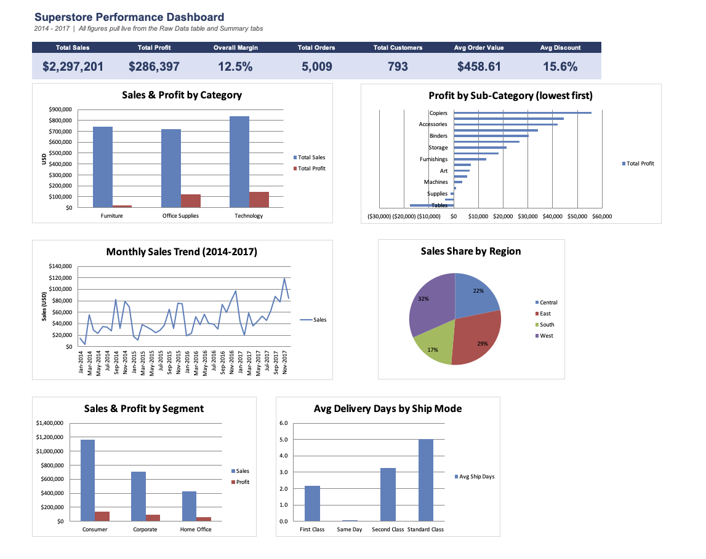
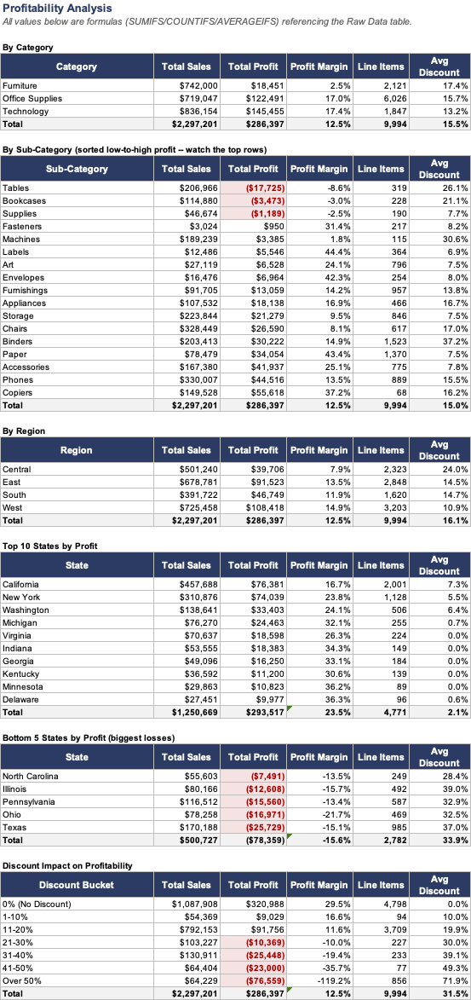

# Superstore Sales & Profitability Analysis
 
An Excel-based analytics project exploring 4 years of retail transaction data to identify where a business makes and loses money — built as a portfolio piece for analyst internship applications (targeting Jan 2027 start).
 
**[📊 View the live workbook (Google Sheets)](#)** &nbsp;|&nbsp; **[⬇️ Download the .xlsx](./Superstore_Analyst_Portfolio_Project.xlsx)**
 
---
 
## Overview
 
This project analyzes **9,994 order line items** (5,009 orders, 793 customers, 2014–2017) from a national retail superstore to answer a simple question: *where is this business actually making money, and where is it quietly losing it?*
 
Rather than just reporting numbers, the workbook is built the way an analyst would hand off findings to a manager — clean source data, fully auditable formulas, a one-page executive dashboard, and written recommendations tied directly to the numbers.
 
| | |
|---|---|
| **Total Sales** | $2,297,201 |
| **Total Profit** | $286,397 |
| **Overall Margin** | 12.5% |
| **Orders / Customers** | 5,009 / 793 |
| **Time Period** | Jan 2014 – Dec 2017 |
 
---
 
## Dashboard
 

 
---
 
## Business Questions Answered
 
**Profitability**
- Which categories, sub-categories, regions, and states drive profit, and which lose money?
- Does discounting help or hurt margin, and at what threshold does it turn negative?
**Trends**
- How do sales and profit move year over year and month over month?
- Which product categories are growing vs. flat?
**Customers**
- Which segment (Consumer / Corporate / Home Office) is most valuable?
- How much of total profit comes from repeat customers vs. one-time buyers?
**Operations**
- How does delivery speed vary by ship mode and region, and does faster shipping cost the business margin?
---
 
## Key Findings
 
1. **Discounting past ~20% destroys profit.** Every discount bucket above 20% is net negative; discounts of 50%+ alone erased ~$77K.
2. **Tables are the single biggest profit drain**, losing ~$17.7K, more than 5x the next-worst sub-category.
3. **Copiers, Phones, and Accessories are the profit engines**, each generating $40K+ in profit.
4. **West and East regions outperform Central and South** by roughly 2x on profit despite comparable sales volume.
5. **Retention is nearly the whole business** — 781 of 793 customers (98%) are repeat buyers, and they account for virtually all recorded profit.
*Full write-up with supporting numbers is on the Insights & Recommendations tab.*
 

 
---
 
## How the Workbook Is Built
 
| Tab | What's in it |
|---|---|
| `README` | Project overview and navigation guide (in-workbook version of this page) |
| `Raw Data` | Source data as an Excel Table + 7 formula-driven helper columns (profit margin, order year/month, ship days, discount bucket, distinct order/customer flags) |
| `Data Cleaning Log` | Live QA checks — nulls, duplicates, date logic, valid ranges — all formulas, all passing |
| `Summary - Profitability` | Category / Sub-Category / Region / State / Discount-bucket breakdowns |
| `Summary - Sales Trends` | Yearly + YoY growth, category-by-year matrix, 48-month trend |
| `Summary - Customers` | Segment performance, top 15 customers, repeat-vs-one-time breakdown |
| `Summary - Operations` | Delivery speed and profitability by ship mode and region |
| `Dashboard` | One-page executive view — 7 KPI cards + 6 charts, all live |
| `Insights & Recommendations` | Written synthesis and next-step recommendations |
 
**Every number is a live formula** (SUMIFS / COUNTIFS / AVERAGEIFS / INDEX-MATCH / IFERROR) referencing the Raw Data table, nothing is hardcoded, so the whole workbook recalculates if the source data changes. ~74,500 formulas, zero errors.
 
---
 
## Skills Demonstrated
 
`Excel Tables & data modeling` · `SUMIFS / COUNTIFS / AVERAGEIFS / INDEX-MATCH / nested IF` · `Named ranges` · `Date & text functions` · `Conditional formatting` · `PivotTables & slicers` · `Power Query` · `Chart design (bar, line, combo, pie)` · `KPI dashboard design` · `Data cleaning & QA` · `Business storytelling / written recommendations`
 
---
 
## Data Source
 
[Sample - Superstore](https://community.tableau.com/s/question/0D54T00000CWeX8SAL/sample-superstore-sales-excel-download) — a widely-used public retail sample dataset (9,994 rows), commonly used for BI/analytics practice.
 
---
 
## Repo Structure
 
```
├── README.md
├── Superstore_Analyst_Portfolio_Project.xlsx
├── data/
│   └── Sample_-_Superstore.csv
└── images/
    ├── dashboard.png
    └── profitability-summary.png
```
 
---
 
## Contact
 
**[Arindam Datta]** — arindamdattabase@gmail.com
 
---
